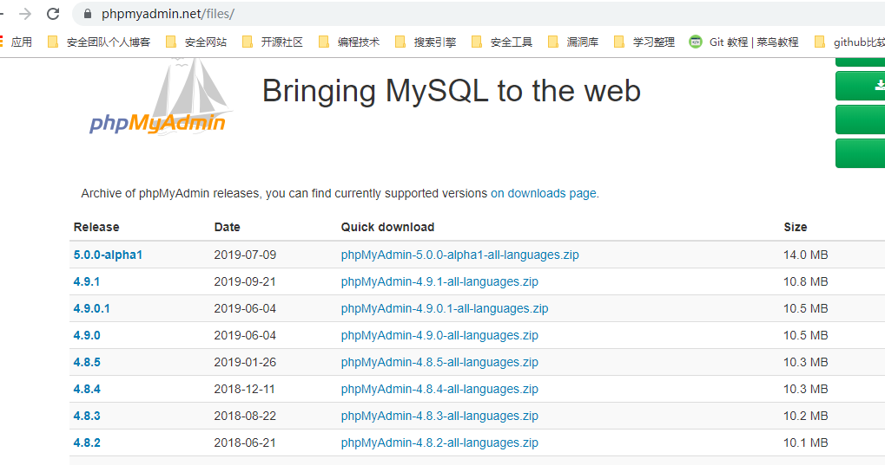
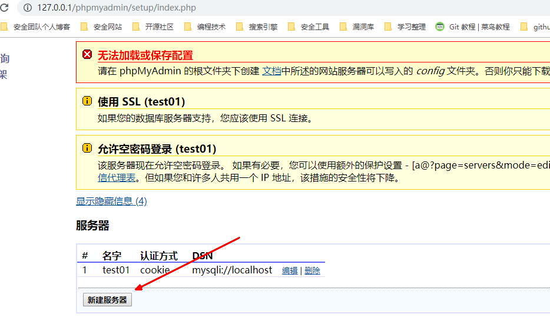
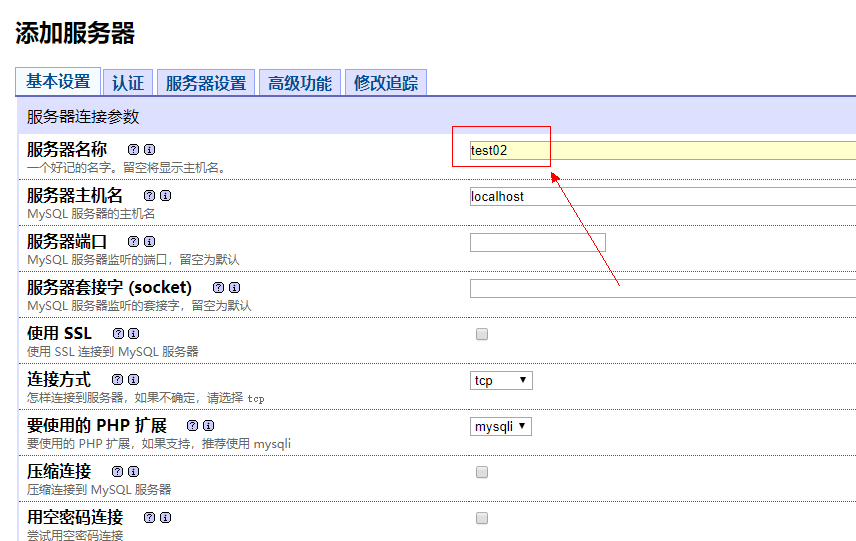
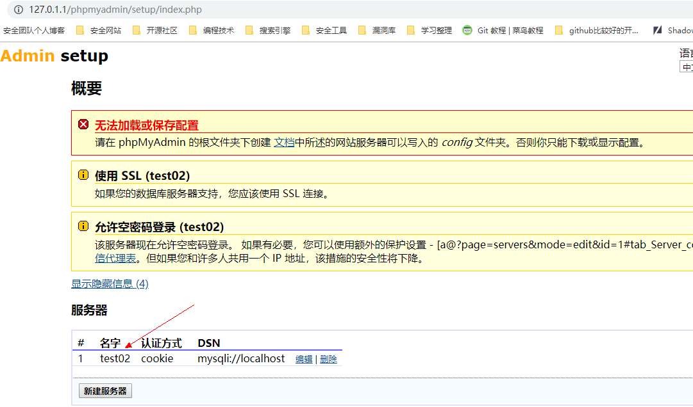

# CVE-2019-12922 phpMyAdmin 4.9.0.1-跨站请求伪造漏洞复现

## **0X01 漏洞概述** 

> 安全研究人员Manuel Garcia Cardenas近日公布了最常用的管理MySQL和MariaDB数据库的应用程序phpMyAdmin中的0 day漏洞细节和PoC。
>
> phpMyAdmin是一个用PHP编写的免费软件工具，也是用于处理MySQL或MariaDB数据库服务器的开源管理工具。phpMyAdmin被广泛用于管理用WordPress, Joomla等内容管理平台的网站的数据库。
>
> 安全研究人员称该漏洞实际上是一个CSRF漏洞，也叫做XSRF漏洞。即攻击者可以诱使认证的用户来执行恶意行为。
>
> 该漏洞CVE编号为CVE-2019-12922，攻击者利用该漏洞来删除受害者服务器上的phpMyAdmin面板上的设置页面中配置的任意服务器。但该攻击并不允许攻击者删除服务器上保存的数据库或表。
>
> 而攻击者只需要发送一个伪造的URL到目标web管理员，要求web管理员已经用相同的浏览器登入phpmyAdmin面板，这样就可以诱使用户通过点击来删除配置的服务器。Cardenas解释说，攻击者在伪造的URL中含有想要由用户执行的请求，这样由于错误使用HTTP方法使用CSRF攻击成为可能。
>
> 该漏洞利用起来非常容易，因为攻击者只需要知道目标服务器的URL就可以了，并不需要了解其他任何信息，包括数据库的name。

* 受影响的版本 

> phpMyAdmin <= 4.9.0.1 

## **0X02 环境搭建** 

在phpMyAdmin官网上找到历史版本下载链接 

> https://www.phpmyadmin.net/files/ 



## **0X03 漏洞复现** 

在登录状态下，添加一个服务器 

> http://127.0.0.1/phpmyadmin/setup/index.php 



已经有test01服务器，创建test02服务器



* **POC**

```html
<p>Deleting Server 1</p>

```

抓包可以发现参数id对应的是第几个服务器 ，我们删除第一个服务器，poc构造如下。


点击我们构造的恶意链接时，成功删除test01服务器



## **0X04 漏洞修复** 

* 升级到最新版，不要轻易点击不可信网页链接 

## 0X05 参考链接

* https://mp.weixin.qq.com/s/TGs1-z8gqAY3-9TFglIHfg

* <https://www.4hou.com/info/news/20380.html> 

  